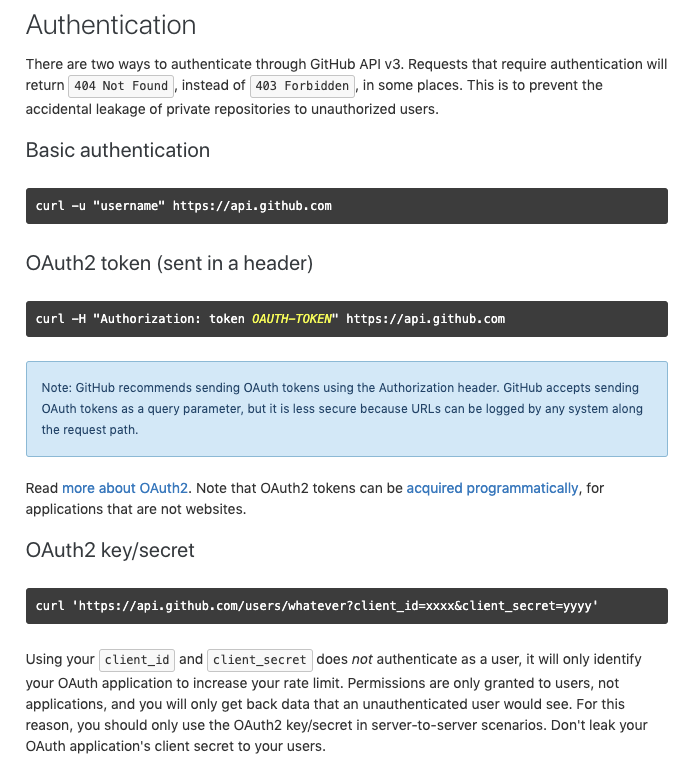

*Last time we were end with the basic `bash` logic to create a new project. This time we are going to be checking the GitHub API and its functionality to list & craete repos. If you haven't follow along from the previous post, I recommend you check it if you are not proficient in `bash`.*

*If you want the source code, it is available at this [gist](https://gist.github.com/littlecastrum/2e1d08d23188fda9817b73854bfef32d)*

> DISCLAIMER: The following script will work for unix based systems. Changes will be necesary for Windows

#### So far:
- Checked if the directory existed.
- Moved into the new (or existing) folder.
- Checked if there was a git repo intiated in the folder.

#### Here is the current code
```bash
name_new_function() {
  dir="/your/projects/folder/$1"
  [ ! -d $dir ] && mkdir $dir
  cd $dir
  if [ ! -d "$(pwd).git" ]; then
    # Test if the repo exists on github
  fi
}
```
#### Here is the objective
```pseudocode
  IF NOT directory exists
    CREATE directory
  END

  MOVE TO directory

  IF NOT ".git" directory

    IF NOT github repo with same name
      CREATE new github repo
    END

    INIT git
    ADD REMOTE git repo
    CREATE README
    PUSH local repo TO remote repo

  END
  OPEN code editor AT pwd
```
## The API

The first thing to take into consideration with most modern APIs is that they control the amount of request that a client can make (The client in this case being us). So for **GitHub** we first have to go check their documentation to learn the `url` we are going to need and the requirements to make request to it.

Currently, they are exposing their `v3` which is very well documented and their authentication policy looks like this:

---


*If you wish to personally check the documentation, you can find it [here](https://developer.github.com/v3/)*

---

This means that we can either use our `username` & `password` or create a `token` which can be reused until **GitHub** inform us that it expired (Which in this case is a long time). Having to enter a `password` defeats the purpose of automation so we are going to be using the `token`. For that we have to do the following:

- First go to the [Developer Settings](https://github.com/settings/tokens) of our **GitHub** account.
- Select `Generate new token`.s
- Introduce a description to the use in the `Note` input.
- Select all `repo` options.
- Select all `admin:repo_hook` options.
- Click `Generate token`
- Copy the new token

Now that we have a token to access the API we can finish up the part of the logic. So before expanding the function to create a new project we are going to create specific functions to access the data in your account. One for listing existing `repos` which will let us decide where or not to create a new `repo`, and another to create.

## Listing repos

According to the documentation, the url to get all `repos` related to a user is `https://api.github.com/user/repos?affiliation=owner`. If you make a `curl` request to this endpoint it will return a long list of `json` data that won't be very useful so we need to first minimize the list into a accesible information. For that the `jq` terminal utility comes to the rescue.

**Here is a few of the ways to install it depending of your current OS:**
```bash
  brew install jq         # MacOS
  sudo apt-get install jq # Debian & Ubutu
  sudo dnf install jq     # Fedora
  sudo pacman -Sy jq      # Arch
```

`jq` uses a particular notation. You have to make a string and if you are receiving an array you can check every element using '.[]'. In this case every element of the array is a JavaScript object so to check a particular key of that object we add '.name_of_key' to the previous, leaving us with '.[].name_of_key'. We need the names so we are going to pass '.[].name'.

**Once we have it we can make the following call to the API and get sensible information:**
```bash
token="your_token_goes_here"
url="https://api.github.com/user/repos?affiliation=owner"
header="Authorization: token $token"
curl -H $header $url  | jq '.[].name' # The | symbol is used to
                                      # "pipe" data into the next
                                      # command
```

We will now turn this into a function, but the `jq` utility we will leave it to use it on the return value that we will consume on the `create-project` one. 

**It will look like this:**

```bash
listrepos() {
  token="your_token_goes_here"
  url="https://api.github.com/user/repos?affiliation=owner"
  header="Authorization: token $token"
  curl -H $header $url
}
```

Now, we need to create the other function that will let us complete the automation, a `newrepo`. To create this one we need a little bit more of knowledge of how `curl` works because we need to make a post request. This information can be found [here](https://developer.github.com/v3/repos/#create). There is a list of elements that we can pass to the endpoint but all we really need is the name. So this function will receive a name. We create a body variable that sets a `jsonstring` using the received name and then send a request using `curl` -X flag for setting it to POST & -d to send the body data. This will return a JSON object which can be ignored or you can use `jq` again if you wish to use this information in anyway.

```bash
newrepo() {
  token="your_token_goes_here"
  url="https://api.github.com/user/repos"
  header="Authorization: token $token"
  body="{\"name\":\"$1\"}"
  curl -H $header -X POST -d $body $url
}
```

**And now we add all we have to the existing function:**
```bash
create() {
  dir="/your/projects/folder/$1"
  repo_exist=$(listrepos | jq '.[].name' | grep -w $1)
  [ ! -d $dir ] && mkdir $dir
  cd $dir
  if [ ! -d "$(pwd).git" ]; then
    [ ! repo_exist  == $1 ] && newrepo $1
  fi
}
```

Lets walk through the changes. First, I gave a proper name to our function (`create`). Second we add a new variable called `repo_exist` and we test if the list returned the name we are trying to create. As you can see, we are piping the list to `grep` another utility. This new utility can catch a patern inside any text that you push into it (It is builtin in all unix distros), we use the -w flag to only return exact matches. If there is no match, we create a new `repo` with the name we passed.

**Now, the rest, is our work is regular `git` commands**

```bash
create() {
  dir="/your/projects/folder/$1"
  repo_exist=$(listrepos | jq '.[].name' | grep -w $1)
  [ ! -d $dir ] && mkdir $dir
  cd $dir
  if [ ! -d "$(pwd).git" ]; then
    [ ! repo_exist  == $1 ] && newrepo $1
    git init
    git remote add origin git@github.com:your_github_acc/$1.git
    touch README.md
    git add .
    git commit -m "Initial commit"
    git push -u origin master
  fi
  code . # I use vscode but you could insert here any
         # text editor that you use
}
```

Now we are done, you have an automated way to create new projects that generates it's github repo, it's own folder, initiates git in it and opens an editor to get right in to work. I hope this gives you a few ideas to make your own automations. The basic idea is set a course, chart a map and get to work.

Till the next post, have a good one.